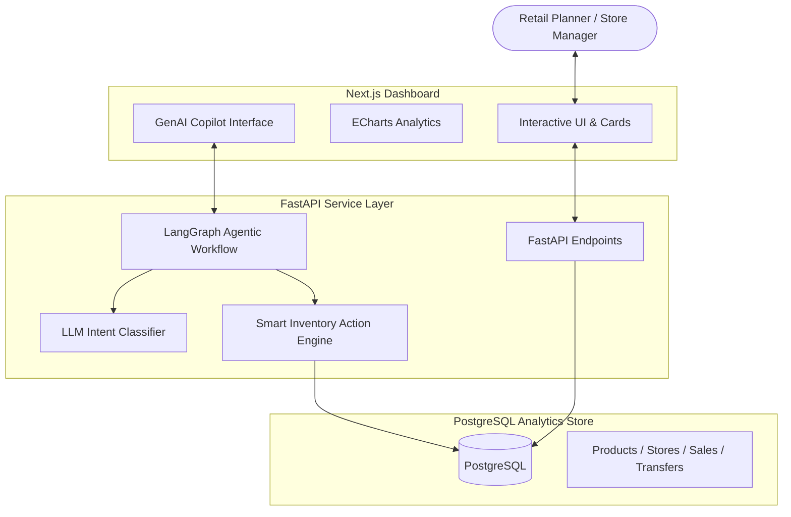

# GenAI Inventory Intelligence Platform

Production-grade inventory decision intelligence system.

Flow:
# 🔎 Stocklens — Retail Decision Intelligence Engine

> **Retailers lose millions not because they lack inventory, but because the right products aren't in the right place at the right time. Existing systems report *what happened*, but fail to recommend *what should happen next*, leaving planners to make critical decisions manually.**

Stocklens is a production-grade, decision-centric inventory intelligence platform. Powered by a deterministic **Smart Inventory Action Engine** and an orchestrating **LangGraph-driven GenAI Copilot**, it turns transactional database patterns (PostgreSQL) into proactive operational actions (transfers, clearance runs, discards, and donations) tailored to user roles and store scopes.

---

## 🏗️ Architecture Flow



---

## ✨ Key Capabilities

### 🧠 1. The Decision Action Engine (`backend/app/services/action_engine.py`)
Moving beyond reports to recommendations, Stocklens evaluates daily inventory metrics, demand trend vectors, and product shelf-life to generate deterministic, executable inventory actions:
*   **Emergency Transfers:** Resolves local stockouts by recommending stock transfers from nearby overstocked hubs.
*   **Markdown & Clearance Sales:** Triggers tiered discounts (e.g., 20% or 40% off) for slow-moving stock or soon-to-expire food items based on remaining shelf life.
*   **Smart Donations:** Identifies non-performing stock with reasonable shelf life and matches them for charity donations (e.g., local orphanages) to optimize tax write-offs and reduce carrying costs.
*   **Safe Discards:** Recommends immediate write-offs for already-expired perishables.

### 🤖 2. LangGraph-Driven GenAI Copilot (`backend/app/services/langgraph_workflow.py`)
Instead of searching through endless tables, planners converse with a specialized inventory agent:
*   **Intent Routing:** Automatically classifies natural language questions into specific action paths (e.g., `morning_brief`, `weekly_report`, `nl_query`, `recommendations`, `chat`).
*   **Access-Scoped SQL Translation:** Translates user queries into Postgres SQL filtering parameters. If a user is scoped as a *Store Manager* for Bangalore, the agent restricts all database querying to that store's schema automatically.
*   **Persistent Context Memory:** Learns user focus areas, communication style preferences, and query patterns over time to personalize summaries.

### 📊 3. Modern Analytics Dashboard (`app/`)
A premium Next.js dashboard featuring:
*   **Inventory Aging Monitor:** Visualizes stock health categories (Fresh, Normal, Slow, Critical).
*   **Interactive Transfer Cards:** Shows source/destination hubs, quantity, transfer reason, and potential revenue saved.
*   **Live Copilot Panel:** Dynamic side-chat for natural-language analysis.

---

## 📂 Project Structure

```text
├── app/                      # Next.js pages (App Router)
│   ├── aging/                # Inventory aging views
│   ├── ai-reports/           # GenAI executive reports
│   ├── analytics/            # Main chart visualizations
│   ├── copilot/              # Dedicated full-screen copilot agent chat
│   ├── donations/            # Donation log tracking
│   ├── inventory/            # Product list & SKU metrics
│   ├── recommendations/      # Action Engine output dashboard
│   ├── transfers/            # Active store-to-store transfers
│   └── layout.tsx            # Navigation & global framework
├── components/               # Shared Next.js UI elements
│   ├── copilot/              # Floating/Sidebar chat panels
│   ├── dashboard/            # Layout widgets & cards
│   └── ui/                   # Primitive design system components (Radix UI)
├── backend/                  # FastAPI Web Server & AI Engine
│   ├── alembic/              # Database schema migrations
│   ├── app/
│   │   ├── api/              # Route controllers (copilot, analytics, realm, auth)
│   │   ├── db/               # SQLAlchemy Session config
│   │   ├── models/           # Postgres database tables
│   │   ├── schemas/          # Pydantic data validations
│   │   └── services/         # LangGraph workflow, Action Engine, Analytics
│   ├── scripts/              # Seed scripts (demo data and production narrative)
│   └── docker-compose.yml    # PostgreSQL and API container runtime
```

---

## 🚀 Setup & Execution

### 1. Backend Setup

#### Local Environment Configuration
Navigate to the backend directory and set up a virtual environment:

```powershell
cd backend
python -m venv .backend-venv
# Windows Activation:
.\.backend-venv\Scripts\Activate.ps1
# Mac/Linux Activation:
# source .backend-venv/bin/activate

pip install -r requirements.txt
cp .env.example .env
```

Open `.env` and fill in your LLM API Keys (Groq or OpenAI):
```env
LLM_PROVIDER=groq  # or 'openai'
GROQ_API_KEY=your_groq_api_key_here
# Optional:
OPENAI_API_KEY=your_openai_api_key_here
```

#### Run Database Migrations
Make sure you have a running PostgreSQL instance, then execute:
```powershell
alembic upgrade head
```

#### Seed the Retail Business Narrative
To populate the database with a 6-month historical retail scenario (with stockouts, overstocking, transfers, and aging trends), run the seed script:
```powershell
python scripts/seed_production_data.py
```
This generates:
*   **Chennai Flagship:** Active regional hub with balanced inventory.
*   **Bangalore Metro:** High-demand store suffering from supply chain disruptions and revenue-at-risk.
*   **Hyderabad Central:** Over-stocked store facing severe carrying-cost issues.
*   **Kochi Fresh Market:** Food-heavy catalog with soon-to-expire item groups.

#### Start the FastAPI Server
```powershell
uvicorn app.main:app --reload --port 8000
```
Verify backend documentation at: `http://localhost:8000/docs`

---

### 2. Running with Docker Compose

Alternatively, spin up the backend and PostgreSQL database inside Docker containers:

```powershell
cd backend
docker compose up --build -d
```
The database will automatically bind to `localhost:5432` with credentials: `inventory:inventory`.

---

### 3. Frontend Setup

Ensure the API URL is pointing to your backend (default is `http://localhost:8000`).

```bash
# Return to workspace root
cd ..
npm install
$env:NEXT_PUBLIC_API_URL="http://localhost:8000"  # Windows PowerShell
# On Mac/Linux: export NEXT_PUBLIC_API_URL="http://localhost:8000"

npm run dev
```

Open `http://localhost:3000` in your web browser.

---

## 📈 Seeded Business Scenario Details

Stocklens's analytical tools can be verified immediately using the seeded story:
1.  **Bangalore Supply Disruption:** High demand for `FOOD-OIL-SUN` (Sunflower Oil) and `CARE-SOAP-BAT` (Soap) paired with zero stock. Shows up as **Revenue at Risk** on the dashboard.
2.  **Hyderabad Overstock:** Shows items with high carrying costs and zero sales for over 30 days (`SNACK-COOKIES`).
3.  **Kochi Expiring Items:** `BEV-JUICE-ORA` (Orange Juice) expiring in 4 days. Triggers a **Donation Offer** or **Markdown Clearance** alert.
4.  **Kochi Expired batch:** `BEV-MILK-TET` (Tetra Pack Milk) is expired. Triggers a **Discard Action**.

---

## 🛠️ API & AI Endpoints

The FastAPI controller exposes standard endpoints:
*   `GET /api/analytics/overview` — Executive KPIs (ROI, carrying cost, revenue-at-risk).
*   `POST /api/copilot/chat` — Core LangGraph conversation agent.
*   `GET /api/copilot/morning-brief` — Auto-generates a morning executive task list.
*   `POST /api/copilot/recommendations` — Runs the Smart Inventory Action Engine manually.
*   `POST /api/copilot/nl-query` — Translates natural language into scoped metrics tables.
based on this can you give me a ats friendly description to add to my resume. it is selected for the final round in Mckinsey Case Championship :Techquest 3.0 (the final results will be revelaed next motnh)

